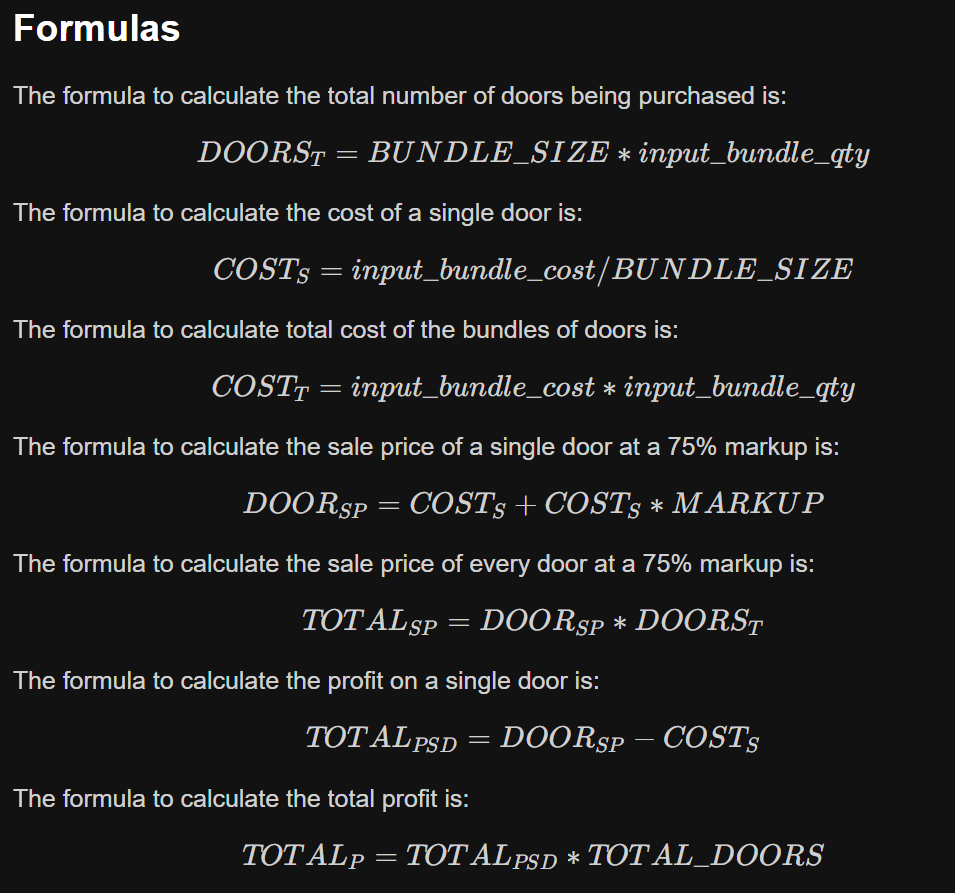

A program for a traveling door to door door salesperson. The salesperson wants to sell doors at a 75% markup by the piece. When the salesperson purchases from their distributor they have to buy doors in bulk bundles of 100 (much too many for one person to buy at once). Whenever the salesperson orders more doors the quantity of bundles needed and bundle price fluctuates.

This is a program that can help the door to door door salesperson calculate how much they will need to charge per door. In order to have a fully functional program for the salesperson the program must:

Formulas used in this project
