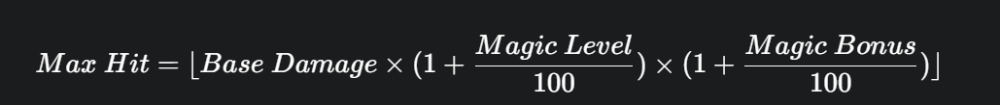

OSRS Magic Max Hit Calculator 🪄
A simple command-line C++ utility to calculate the max hit of basic Fire spells in Old School RuneScape based on your character's stats. The output is formatted into a clean, easy-to-read table.

This tool uses the standard C++ libraries <iomanip> for formatting and <cmath> for calculations.
