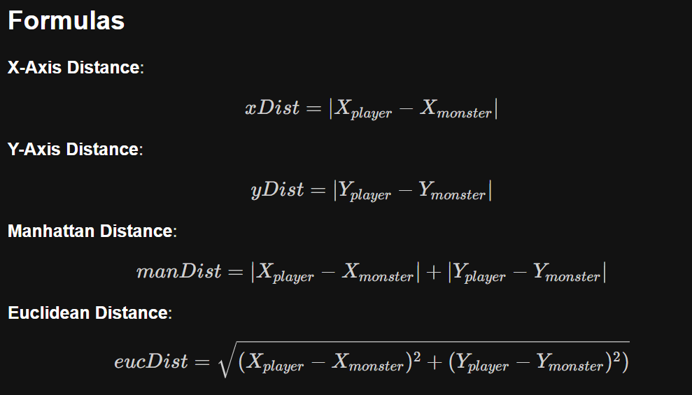

A video game that tells how far monsters are away from the player. This way the program knows if the player is close enough to attack a monster, or if the player gets too close to a monster that auto attacks. There are two ways to calculate the distance between the player and the monster: manhattan distance and euclidean distance. You want to know which is more accurate for the game. This is a  program that computes the distance between the player and monster, then outputs the results. The program does the following:
    Compute the distance along the x-axis and y-axis and save them into integer variables (see below for formulas).

    Compute the manhattan and euclidean distances between the points and save them into floating-point variables (see below for formulas).

    Output the distances then visualize the distances using <iomanip> (see criteria on how to below).
